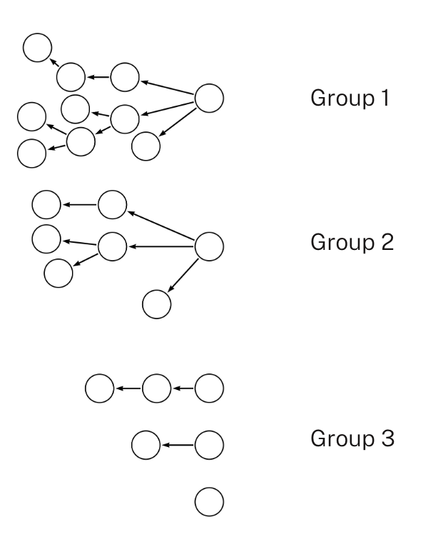
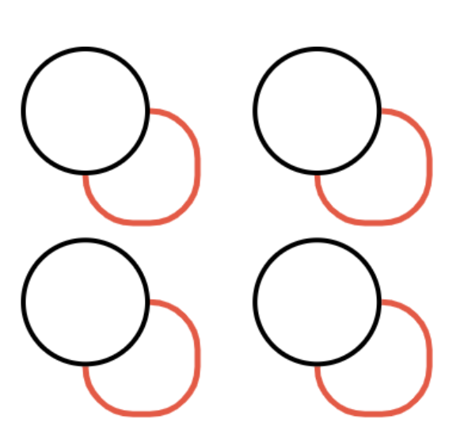

# neo4j-parallel-spark-loader
Neo4j Parallel Spark Loader is a Python library for grouping and batching dataframes in a way that supports parallel relationship loading into Neo4j. As an ACID-compliant database, Neo4j uses locks when writing relationships to the database. When multiple processes attempt to write to the same node at the same time, deadlocks can occur. This is why the [Neo4j Spark Connector documentation](https://neo4j.com/docs/spark/current/write/relationship/) recommends reformatting Spark DataFrames to a single partition before writing relationships to Neo4j.

Neo4j Parallel Spark Loader allows parallel relationship writes to Neo4j without deadlocking by breaking a Spark dataframe into one or more batches of rows. Within each batch, rows are further subdivided into groupsin such a way that each node ID value appears in only one group per batch. All groups within a batch can be written to Neo4j in parallel without deadlocking because the same node is never touched by relationships in concurrent write transactions. Batches are loaded one-after-the-other to ingest the whole dataframe to Neo4j.

## Key Features
* Supports multiple relationship batching and grouping scenarios:
    * Predefined components
    * Bipartite data
    * Monopartite data

## Additional Dependencies

This package requires 
* Neo4j Spark Connector JAR file installed on the Spark cluster

## A quick example
Imagine that you have a Spark DataFrame of customer purchase records. It includes columns `customer_id`, and `store_id`. You would like to load a `PURCHASED_FROM` relationship. 

```
import parallel_spark_loader

...show setting up spark session with config and loading data

# Create batches and groups
batched_purchase_df = parallel_spark_loader.bipartite.grouping_and_batching.group_and_batch_spark_dataframe(purchase_df, 'customer_id', 'store_id', 8)

# Load to Neo4j
purchased_from_query = """
    MATCH (c:Customer {id: event['customer_id']}),
    (s:Store {id: event['store_id']})
    MERGE (c)-[:PURCHASED_FROM {purchaseDatetime:event['datetime']}]->(s)

#Load groups in parallel for each batch
parallel_spark_loader.utils.ingest_spark_dataframe(purchase_df, "Overwrite", {"query": purchased_from_query})

```

## Grouping and batching scenarios

Grouping and batching scenarios of various levels of complexity can be appropriate depending on the structure of the relationship data being loaded to Neo4j. The Neo4j Parallel Spark Loader library supports three scenarios: predefined components, bipartite data, and monopartite data.

### Predefined components

In some relationship data, the relationships can be broken into distinct components based on a field in the relationship data. For example, you might have a DataFrame of HR data with columns for `employeeId`, `managerId`, and `department`. If we are wanting to create a `MANAGES` relationship between employees and managers, and we know in advance that all managers are in the same department as the employees they manage, we can separate the rows of the dataframe into components based on the `department` key.

Often the number of predefined components is greater than the number of workers in the Spark cluster, and the number of rows within each component is unequal. When running parallel_spark_loader.bipartite.grouping_and_batching.group_and_batch_spark_dataframe, you specify the number of groups that you want to collect the partitioned data into. This should value should be less than or equal to the number of workers in your Spark cluster. Neo4j Parallel Spark Loader uses a greedy algorithm to assign partitions into groups in a way that attempts to balance the number of relationships within each group. When loading this ensures that each Spark worker stays equally instead of some workers waiting while other workers finish loading larger groups.



We can visualize the nodes within the same group as a single aggregated node and the relationships that connect nodes within the same group as a single aggregated relationship. In this image, we can see that no aggregated nodes are connected to the same aggregated relationships. Therefore, transactions within the different aggregated relationships can run in parallel without deadlocking.


