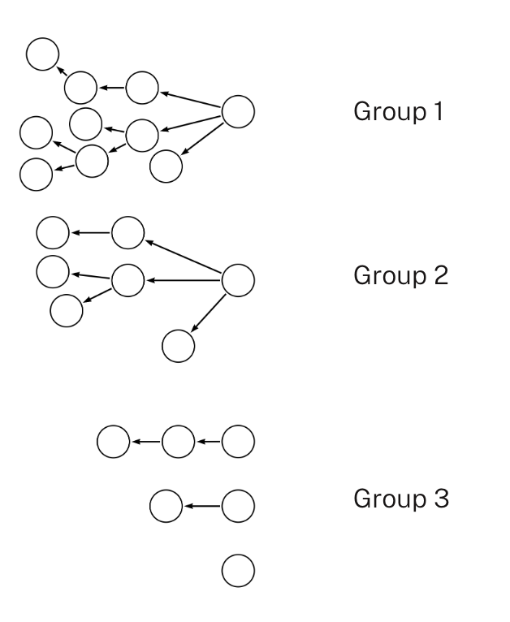
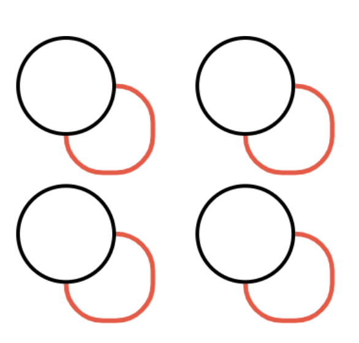
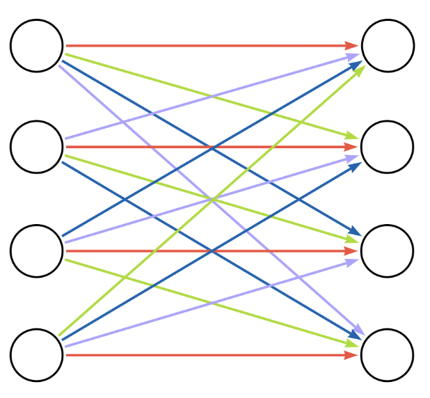
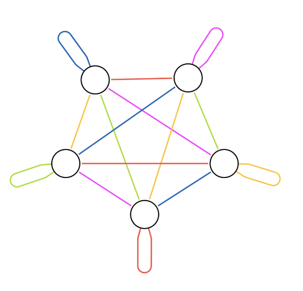
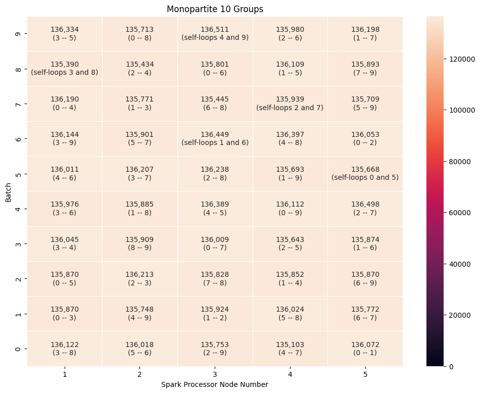

# neo4j-parallel-spark-loader
Neo4j Parallel Spark Loader is a Python library for grouping and batching dataframes in a way that supports parallel relationship loading into Neo4j. As an ACID-compliant database, Neo4j uses locks when writing relationships to the database. When multiple processes attempt to write to the same node at the same time, deadlocks can occur. This is why the [Neo4j Spark Connector documentation](https://neo4j.com/docs/spark/current/write/relationship/) recommends reformatting Spark DataFrames to a single partition before writing relationships to Neo4j.

Neo4j Parallel Spark Loader allows parallel relationship writes to Neo4j without deadlocking by breaking a Spark dataframe into one or more batches of rows. Within each batch, rows are further subdivided into groups in such a way that each node ID value appears in only one group per batch. All groups within a batch can be written to Neo4j in parallel without deadlocking because the same node is never touched by relationships in concurrent write transactions. Batches are loaded one-after-the-other to ingest the whole dataframe to Neo4j.

*Note: This package was developed with Spark v3.4.0. It is recommended to use this version of Spark.*

## Key Features
Supports multiple relationship batching and grouping scenarios:
* Predefined Components
* Bipartite Data
* Monopartite Data

## Additional Dependencies

This package requires 
* [Neo4j Spark Connector](https://neo4j.com/docs/spark/current/installation/) JAR file installed on the Spark cluster

## A quick example
Imagine that you have a Spark DataFrame of order records. It includes columns `order_id`, `product_id`, and `quantity`. You would like to load a `INCLUDES_PRODUCT` relationship. 

```
from pyspark.sql import DataFrame, SparkSession

from neo4j_parallel_spark_loader.bipartite import group_and_batch_spark_dataframe
from neo4j_parallel_spark_loader import ingest_spark_dataframe

spark_session: SparkSession = (
    SparkSession.builder.appName("Workflow Example")
    .config(
        "spark.jars.packages",
        "org.neo4j:neo4j-connector-apache-spark_2.12:5.1.0_for_spark_3",
    )
    .config("neo4j.url", "neo4j://localhost:7687")
    .config("neo4j.authentication.type", "basic")
    .config("neo4j.authentication.basic.username", "neo4j")
    .config("neo4j.authentication.basic.password", "password")
    .getOrCreate()
)

purchase_df: DataFrame = spark_session.createDataFrame(data=...)

# Create batches and groups
batched_purchase_df = group_and_batch_spark_dataframe(
    purchase_df, "customer_id", "store_id", 8
)

# Load to Neo4j
includes_product_query = """
MATCH (o:Order {id: event['order_id']}),
(p:Product {id: event['product_id']})
MERGE (o)-[r:INCLUDES_PRODUCT]->(p)
ON CREATE SET r.quantity = event['quantity']
"""

# Load groups in parallel for each batch
ingest_spark_dataframe(batched_purchase_df, "Overwrite", {"query": includes_product_query})


```

## Grouping and batching scenarios

Grouping and batching scenarios of various levels of complexity can be appropriate depending on the structure of the relationship data being loaded to Neo4j. The Neo4j Parallel Spark Loader library supports three scenarios: predefined components, bipartite data, and monopartite data.

Each grouping and batching scenario has its own module. The `group_and_batch_spark_dataframe` function in each module accepts a Spark DataFrame with parameters specific to the scenario. It appends `batch` and `final_grouping` columns to the DataFrame. The `ingest_spark_dataframe()` function splits the original DataFrame into separate DataFrames based on the value of the `batch` column. Each batch's dataframe is repartitioned so that every group occupies exactly one Spark partition and then written to Neo4j with Spark workers processing groups in parallel.

### Ingesting very large DataFrames

Each batch is a filter over the grouped DataFrame, and Spark recomputes the input plan for every batch. For large inputs pass `checkpoint_path` to `ingest_spark_dataframe()`. The grouped DataFrame is then written once as Parquet partitioned by `batch`, and each batch reads only its own files:

```
ingest_spark_dataframe(
    batched_df, "Overwrite", options, checkpoint_path="s3://bucket/tmp/relationship-load/"
)
```

If the job fails partway through, the checkpoint is still there. Read it back, filter to the batches that did not finish, and pass the result to `ingest_spark_dataframe()` again without a `checkpoint_path`. Delete the checkpoint once the load is complete.

For sustained loads of hundreds of millions of relationships, also pass `sort_columns=[source_col]`. Hash grouping leaves rows in random order, so each transaction touches unrelated node records and dirties a fresh page almost every row, and Neo4j's checkpoints grow until commits are waiting on disk. Sorting each group by the source id makes consecutive rows update the same node record and relationship chain, so each transaction dirties far fewer pages. The sort is local to each partition and does not change grouping or batching.

Progress is logged per batch at INFO level through the `neo4j_parallel_spark_loader.utils.ingest` logger.

### Predefined components scenario

In some relationship data, the relationships can be broken into distinct components based on a field in the relationship data. For example, you might have a DataFrame of HR data with columns for `employeeId`, `managerId`, and `department`. If we are wanting to create a `MANAGES` relationship between employees and managers, and we know in advance that all managers are in the same department as the employees they manage, we can separate the rows of the dataframe into components based on the `department` key.

Often the number of predefined components is greater than the number of workers in the Spark cluster, and the number of rows within each component is unequal. When running `parallel_spark_loader.predefined_components.group_and_batch_spark_dataframe()`, you specify the number of groups that you want to collect the partitioned data into. The optimal number of groups depends on the capacity of your Spark cluster and the Neo4j instance you are loading. As a rule of thumb, the number of groups should be less than or equal to the total number of executor CPUs on your Spark cluster. Neo4j Parallel Spark Loader uses a greedy algorithm to assign partitions into groups in a way that attempts to balance the number of relationships within each group. When loading this ensures that each Spark worker stays equally instead of some workers waiting while other workers finish loading larger groups.



We can visualize the nodes within the same group as a single aggregated node and the relationships that connect nodes within the same group as a single aggregated relationship. In this image, we can see that no aggregated nodes are connected to the same aggregated relationships. Therefore, transactions within the different aggregated relationships can run in parallel without deadlocking.



### Bipartite data scenario

In many relationship datasets, there is not a paritioning key in the Spark DataFrame that can be used to divide the relationships into predefined components. However, we know that no nodes in the dataset will be *both a source and a target* for this relationship type. Often this is because the source nodes and the target nodes have different node labels and they represent different classes of things in the real world. For example, you might have a DataFrame of order data with columns for `orderId`, `productId`, and `quantity`, and you want to create `INCLUDES_PRODUCT` relationships between `Order` and `Product` nodes. You know that all source nodes of `INCLUDES_PRODUCT` relationships will be `Order` nodes, and all target nodes will be `Product` nodes. No nodes will be *both source and target* of that relationship.

When running `parallel_spark_loader.bipartite.group_and_batch_spark_dataframe()`, you specify the number of groups that you want to collect the source and target nodes into. The optimal number of node groups depends on the capacity of your Spark cluster and the Neo4j instance you are loading. As a rule of thumb, the number of node groups should be less than or equal to the total number of executor CPUs on your Spark cluster. Neo4j Parallel Spark Loader uses a greedy alogrithm to assign source node values to source-node groups so that each group represents roughly the same number of rows in the relationship DataFrame. Similarly, the library groups the target node values into target-node groups with roughly balanced size.

We can visualize the nodes within the same group as a single aggregated node and the relationships that connect nodes within the same group as a single aggregated relationship. 



In the aggregated biparite diagram, multiple relationships (each representing a group of individual relationships) connect to each node (representing a group of nodes). Using a straightforward alternating algorithm, the relationships are colored so that no relationships of the same color point to the same node. The relationship colors represent the batches applied to the data. In the picture above, the relationship groups represented by red arrows can be processed in parallel because no node groups are connected to more than one red relationship group. After the red batch has completed, each additional color batch can be processed in turn until all relationships have been loaded.

### Monopartite data scenario

In some relationship datasets, the same node is the source node of some relationships and the target node of other relationships. For example, you might have a DataFrame of phone call data with columns for `calling_number`, `receiving_number`, `start_datetime`, and `duration`. You want to create `CALLED` relationships between `PhoneNumber` nodes. The same `PhoneNumber` node can be the source for some `CALLED` relationships and the target for other `CALLED` relationships.

When running `parallel_spark_loader.monopartite.group_and_batch_spark_dataframe()`, the library uses the union of the source and target nodes as the basis for assigning nodes to groups. As with other scenarios, you select the number of groups that should be created, and a greedy algorithm assigns node IDs to groups so that the combined number of source and target rows for the IDs in a group is roughly equal. 

As with the other scenarios, you set the number of groups that will be assigned by the algorithm. The optimal number of groups depends on the resources on the Spark cluster and the Neo4j instance. However, unlike the predefined components and bipartite scenarios, in the monopartite scenario, *the number of node groups should be 2 times the number of parallel transactions that you want to execute*. This is because a group can represent the source of a relationship and the target of a relationship. 

We can visualize the nodes within the same group as a single aggregated node and the relationships that connect nodes within the same group as a single aggregated relationship. 



In the aggregated monopartite diagram, multiple relationships (each representing a group of individual relationships) connect to each node (representing a group of nodes). Because nodes could be either source or target, there are no arrow heads in the diagram representing relationship direction. However, the nodes are always stored with a direction in Neo4j. Using the rotational symmetry of the complete graph, the relationships are colored so that no relationships of the same color connect to the same node. The relationship colors represent the batches applied to the data. In the picture above, the relationship groups represented by red arrows can be processed in parallel because no node groups are connected to more than one red relationship group. After the red batch has completed, each additional color batch can be processed in turn until all relationships have been loaded. Notice that with five node groups, each color batch contains three relationship groups. This demonstrates why the number of groups should be larger than the number of parallel transactions that you want to execute.

## Grouping strategies

Each scenario's `create_node_groupings`/`group_and_batch_spark_dataframe` function accepts a `strategy` parameter: `"greedy"` (the default) or `"hash"`.

* **`greedy`** groups node IDs so that each group represents roughly the same number of rows. To do this, it counts every distinct node ID on the driver and runs a single-threaded bin-packing pass over that list before joining the result back onto the DataFrame. This produces well-balanced groups, but the driver-side count/collect/join steps do not scale to datasets with a very large number of distinct node IDs, and can exhaust driver memory.
* **`hash`** assigns each row's group with `hash(id) % num_groups`, computed entirely within Spark. There is no driver collect and no join, so it scales to arbitrarily large datasets. The tradeoff is that group sizes are not balanced by row count -- they are only as balanced as the hash distribution of the ID values happens to be.

Use `hash` when you have a very large number of distinct node IDs and greedy grouping is too slow or is exhausting driver memory. Prefer `greedy` (the default) when the dataset is small enough for the driver to handle, or when a small number of "supernode" IDs account for a disproportionate share of the rows -- since `hash` does not balance for this, a supernode's rows can pile up in whichever groups its ID happens to hash into, creating a slow, unbalanced batch. Check your data's degree distribution (for example, the top 50 node IDs by row count) before choosing `hash` on data you suspect may have supernodes.

`null` node IDs (or, for predefined components, a `null` partition value) are assigned a `null` group under both strategies. Because the group is `null`, the batch is `null` as well, and these rows cannot be loaded as relationships. `ingest_spark_dataframe()` counts them before writing and raises a `ValueError` by default; pass `on_null_batch="skip"` to emit a warning and ingest the remaining rows instead.

```
from neo4j_parallel_spark_loader.bipartite import group_and_batch_spark_dataframe

batched_purchase_df = group_and_batch_spark_dataframe(
    purchase_df, "customer_id", "store_id", 8, strategy="hash"
)
```

## Workflow Visualization

The visualization module may be used to create a heatmap of the workflow. 

* Batches are identified as rows. 
* Groups that will be processed in a batch are shown as cells in the row.
* The number of relationships in the relationship group and the relationship group name are shown in each cell.
* For optimal processing, the number of relationships in each row should be similar.

This function may be imported with `from neo4j_parallel_spark_loader.visualize import create_ingest_heatmap` and takes a Spark DataFrame with columns including `group` and `batch` as input.

Here is an example of a generated heatmap with monopartite data with ten node groups:



## Simplified Relationship Building

The `build_relationship` function is designed to simplify the process of building relationships in parallel. It only takes a few simple parameters.

* The DataFrame to process
* The name of the Relationship
* The source and target node labels and id properties
* Optional Relationship properties
* The group keys to be used for grouping

The function uses the size of the DataFrame to decide whether to process in parallel or serially.  The threshold can be set by passing in `max_serial` which defaults to 1,000,000 rows.  

It also decides which grouping methodology to use based on the number of `group_keys` that given.  Passing in a single key will result in a `predefined` grouping while passing 2 keys in will result in a `bipartite` grouping.  `monopartite` is not yet supported.

The function assumes a `num_groups` of 10 for the grouping and ingestion calls.  This can also be overwritten by passing the desired value to `num_groups`

This function may be imported with `from neo4j_parallel_spark_loader import build_relationship`

Example Code Snippet

```
    build_relationship(df,
                       "INCLUDES_PRODUCT",
                       "Order","order_id",
                       "Product","product_id",
                       group_keys=["product_id"],
                       rel_props=["quantity"]
                       )

```